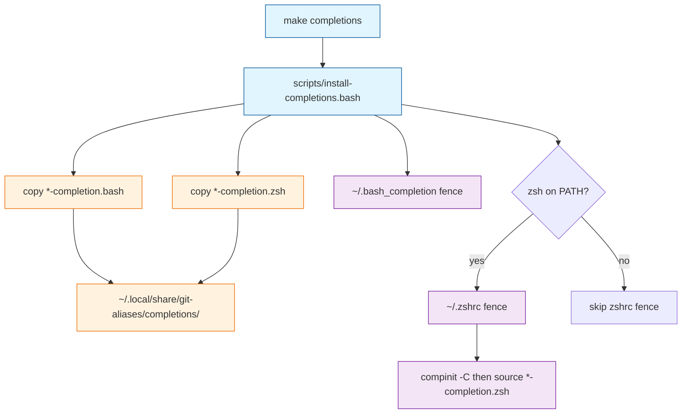

# Task: zsh-completion

* Task ID: zsh-completion
* Complexity: Level 2
* Type: simple enhancement

Add zsh tab completion for `git sync` and `git identity` with the same coverage as the existing bash completions. Install and uninstall through `make completions` / `make clean`. Do not add `git wt` completion. Do not rewrite the bash completers.

ai-rizz `zsh-tabs` is a reference for fence + `compinit` bootstrap + `zsh -c` tests with stubbed `compadd`. It is not a copy: ai-rizz completes a standalone CLI; this repo must complete both `git ` and `git-`.

**Locked approach:** Native zsh completers (`words` / `CURRENT` / `compadd`), living next to the bash scripts as `subcommands/git-<name>/git-<name>-completion.zsh`. Source them from a fenced `~/.zshrc` block (same install directory as bash). Do not put files on `fpath`. One installer owns both dialects (uninstall today `rm -rf`s the completions dir). That installer is Bash, so this task **renames** `scripts/install-completions.sh` to `scripts/install-completions.bash` and updates callers; it does not POSIX-rewrite the script and does not rename the other misnamed `scripts/install-*.sh` files.

**RC-file invariant (justified change):** Default `make` already writes `~/.bash_completion` via `completions`. This task also writes a fenced `~/.zshrc` block when `zsh` is on PATH. It still does not edit `~/.bashrc`; opt-in `make shell` remains the only path that writes the `wt()` fences to `~/.bashrc` and `~/.zshrc`. Record that split in `memory-bank/systemPatterns.md`, `memory-bank/productContext.md`, and `memory-bank/techContext.md`.

**Git dispatch:** Each zsh file defines `_git_<name>` (implementation), `_git-<name>` as a one-line wrapper for zsh’s native `_git`, and `compdef _git_<name> git-<name>` for the standalone command. Append to `zstyle ':completion:*:*:git:*' user-commands` without replacing existing entries. Skip registration when `GIT_ALIASES_COMPLETION_TEST` is set. Tests invoke the functions directly; they do not drive `git <TAB>` through `_git`.

## Test Plan (TDD)

### Behaviors to Verify

- **sync branches:** `words=(git-sync '')` or `words=(git sync '')` → `compadd` local branch names from the current repo
- **sync flags:** same prev, `cur` starts with `-` → `-m` `--merge` `-h` `--help`
- **sync after merge flag:** prev is `-m` or `--merge` → branch names
- **sync after help flag:** prev is `-h` or `--help` → no candidates
- **sync empty repo:** no local branches → no candidates, exit 0
- **sync standalone register:** source `git-sync-completion.zsh` in `zsh -f` without prior `compinit` → `_comps[git-sync]` is set
- **identity commands:** `words=(git-identity '')` or `words=(git identity '')` → `list` `use` `create`
- **identity use names:** prev is `use`, fake `HOME/.git-identities` has files → those basenames
- **identity use missing dir:** prev is `use`, no identities dir → no candidates, exit 0
- **identity after list/create:** prev is `list` or `create` → no candidates
- **identity standalone register:** source `git-identity-completion.zsh` in `zsh -f` without prior `compinit` → `_comps[git-identity]` is set
- **source silent:** sourcing either zsh completer prints nothing
- **zsh missing:** `tests/test-zsh-completion.sh` in a `PATH` that has only a temp directory of symlinks to the utilities the suite needs before the zsh check (`dirname` and the like), with no `zsh` → exit non-zero (do not skip). Do not drop `/bin` or `/usr/bin` wholesale.
- **install copies zsh:** with `zsh` on `PATH` and isolated `HOME`, installer copies `*-completion.zsh` into `~/.local/share/git-aliases/completions/`
- **install zsh fence:** writes `# >>> git-aliases zsh completion >>>` … `# <<< git-aliases zsh completion <<<` to `~/.zshrc`, runs `compinit -C`, sources the installed `*-completion.zsh` files
- **install idempotent:** running install twice leaves one zsh fence
- **install preserves zshrc:** pre-existing `.zshrc` lines remain; fence is distinct from `# >>> git-aliases shell integration >>>`
- **install without zsh:** `GIT_ALIASES_ZSH` set to empty → installer exits 0, no zshrc fence, bash copy and `~/.bash_completion` fence still happen. Do not implement this by dropping a `PATH` directory; `zsh` shares `/bin` (macOS) and `/usr/bin` (CI) with utilities the installer needs.
- **uninstall zsh:** removes zsh fence, keeps other `.zshrc` content; second uninstall is a no-op
- **bash install unregressed:** installer still copies `*-completion.bash` and writes the existing bash fence; uninstall still strips that fence
- **make test runs new suites:** `make -n test` invokes `tests/test-zsh-completion.sh` and `tests/test-install-completions.sh`
- **make uses renamed installer:** `make -n completions` and `make -n clean` invoke `scripts/install-completions.bash`, not `scripts/install-completions.sh`

### Test Infrastructure

- Framework: homemade POSIX `tests/test-*.sh` (fail helper + `failures` count). Isolated `HOME` via `mktemp` as in `tests/test-install-shell-integration.sh`. Zsh invoked as `zsh -c` / `zsh -f -c` as in `tests/test-wt-wrappers.sh`.
- Test location: `tests/`
- Conventions: `#!/bin/sh`, `set -eu`, `fail()`, `run_isolated` for anything that writes under `HOME`, run the script as `./tests/test-foo.sh`. Do not add shunit2 suites. Fail if `zsh` is missing; do not skip.
- New test files: `tests/test-zsh-completion.sh`, `tests/test-install-completions.sh`

## Implementation Plan

### 1. git-sync zsh completer — executable

- Files: `tests/test-zsh-completion.sh`, `subcommands/git-sync/git-sync-completion.zsh`

1. Stub tests: create `tests/test-zsh-completion.sh` with empty cases `test_sync_completes_branches`, `test_sync_completes_flags_when_cur_starts_dash`, `test_sync_after_merge_flag_completes_branches`, `test_sync_after_help_flag_completes_nothing`, `test_sync_empty_repo_completes_nothing`, `test_sync_registers_compdef_without_prior_compinit`, `test_sync_source_is_silent`, `test_zsh_missing_fails`. Helper stubs: `_complete_sync`, `_source_sync`. Abort at startup if `command -v zsh` fails.
2. Stub interface: create `subcommands/git-sync/git-sync-completion.zsh` with empty `_git_sync`, `_git-sync`, and `_git_sync_register`. No shebang (sourced). Skip `compdef` when `GIT_ALIASES_COMPLETION_TEST` is set.
3. Write tests and run red: `./tests/test-zsh-completion.sh`. Isolated git repo with at least two local branches for branch cases; `zsh -c` sources the completer with `GIT_ALIASES_COMPLETION_TEST=1`, sets `words`/`CURRENT`, stubs `compadd` to print names. Register case uses `zsh -f` without the test env var. Missing-zsh case builds a temp `PATH` directory of symlinks (no `zsh`) and runs the suite; the suite must still be able to resolve `dirname` so the failure is the zsh check, not a crash.
4. Write code and run green: implement `_git_sync` with the same prev/cur cases as `git-sync-completion.bash` (branches vs dash-options vs after `-m`/`--merge` vs after `-h`/`--help`). List branches with `git --no-pager for-each-ref --format='%(refname:short)' refs/heads/`. `_git-sync` calls `_git_sync`. `_git_sync_register` bootstraps `compinit`/`compdef` if needed, `compdef _git_sync git-sync`, and appends `sync` to git `user-commands` without replacing the style. Re-run `./tests/test-zsh-completion.sh`.

### 2. git-identity zsh completer — executable

- Files: `tests/test-zsh-completion.sh`, `subcommands/git-identity/git-identity-completion.zsh`

1. Stub tests: add empty cases `test_identity_completes_commands`, `test_identity_use_completes_names`, `test_identity_use_missing_dir_completes_nothing`, `test_identity_after_list_or_create_completes_nothing`, `test_identity_registers_compdef_without_prior_compinit`, `test_identity_source_is_silent`. Helper stubs: `_complete_identity`, `_source_identity`.
2. Stub interface: create `subcommands/git-identity/git-identity-completion.zsh` with empty `_git_identity`, `_git-identity`, and `_git_identity_register`. Same test-env skip as sync.
3. Write tests and run red: `./tests/test-zsh-completion.sh`. `use` cases use isolated `HOME` with files under `.git-identities`. Register case mirrors sync with `_comps[git-identity]`.
4. Write code and run green: same command/`use`/`list`/`create` cases as `git-identity-completion.bash`. Register `compdef _git_identity git-identity` and append `identity` to git `user-commands`. Re-run `./tests/test-zsh-completion.sh`.

### 3. Completions installer, rename, and make test wiring — executable

- Files: `tests/test-install-completions.sh`, `scripts/install-completions.sh` (renamed to `scripts/install-completions.bash`), `Makefile`

1. Stub tests: create `tests/test-install-completions.sh` with empty cases `test_install_copies_zsh_and_writes_fence`, `test_install_idempotent`, `test_install_preserves_zshrc_and_distinct_fence`, `test_install_without_zsh_skips_zshrc_keeps_bash`, `test_uninstall_removes_zsh_fence`, `test_second_uninstall`, `test_bash_copy_and_fence_unregressed`, `test_make_n_test_runs_new_suites`, `test_make_completions_and_clean_invoke_bash_installer`. Point the installer path at `scripts/install-completions.bash`. Every case that runs the installer, including without-zsh, uses `run_isolated` from `tests/test-install-shell-integration.sh` so a test never writes the operator’s `~/.zshrc`. Makefile contract uses `make -n`, not a real install.
2. Stub interface: `git mv` `scripts/install-completions.sh` to `scripts/install-completions.bash`. Update the `Makefile` `completions` and `clean` recipes (and the `chmod` line) to the new name. Do not wire the new test scripts into the `Makefile` `test` target yet. In the renamed installer, add empty `install_zsh_completions` and `uninstall_zsh_completions` (or equivalent), zsh fence constants distinct from the bash fence and from the shell-integration fence, and zsh detection `GIT_ALIASES_ZSH="${GIT_ALIASES_ZSH-$(command -v zsh || true)}"` (empty override means no zsh). Do not change bash copy/fence behavior yet.
3. Write tests and run red: `./tests/test-install-completions.sh`. Assert copy of `*-completion.zsh`, zshrc fence with `compinit -C` and `source` of installed zsh files, one fence after two installs, preserved unrelated `.zshrc` lines, no collision with the shell-integration fence marker. Without-zsh: export `GIT_ALIASES_ZSH` empty, assert installer exit 0, no zshrc fence, bash copy and `~/.bash_completion` fence present (a crash must not count as a pass). Uninstall strips zsh fence twice-safe. Bash `*-completion.bash` copy + `~/.bash_completion` fence still present. `make -n test` output contains `test-zsh-completion.sh` and `test-install-completions.sh`. `make -n completions` and `make -n clean` invoke `scripts/install-completions.bash` and not `scripts/install-completions.sh`.
4. Write code and run green: implement zsh copy/fence when `GIT_ALIASES_ZSH` is non-empty; uninstall always strips the zsh fence and still `rm -rf`s `INSTALL_DIR`. Mirror the bash loop’s `if [ -f ... ]` guard on the `*-completion.zsh` glob (`set -u`, no `nullglob`). Fence must not use the shell-integration marker. Wire `tests/test-zsh-completion.sh` and `tests/test-install-completions.sh` into the `Makefile` `test` target (`chmod` + run). Re-run `./tests/test-install-completions.sh`, then `./tests/test-zsh-completion.sh`, then `make test`.

### 4. README completions section — prose/policy

- Files: `README.md`
- No tests: prose/policy artifact

1. Change the overview bullet and the `make completions` comment so they name bash and zsh, not bash only.
2. Rewrite the Bash Completion section into a Completions section: copy to `~/.local/share/git-aliases/completions/`, bash fence in `~/.bash_completion`, zsh fence in `~/.zshrc` when `zsh` is on `PATH` (this is part of default `make`, not `make shell`), restart or source to enable. Do not add a change-detector test.

### 5. Persistent memory-bank invariant — prose/policy

- Files: `memory-bank/systemPatterns.md`, `memory-bank/productContext.md`, `memory-bank/techContext.md`
- No tests: prose/policy artifact

1. In `systemPatterns.md`, name `install-completions.bash` in both the bash-completion sourcing sentence and the idempotency installer list (currently `install-completions.sh`); document optional `git-<name>-completion.zsh` companions; replace “default `make` must not edit `~/.bashrc` or `~/.zshrc`” with: default `make` (via `completions`) writes `~/.bash_completion` and, when `zsh` is on PATH, a fenced completions block in `~/.zshrc`; it does not edit `~/.bashrc`. `make shell` remains the opt-in `wt()` fences on `~/.bashrc` and `~/.zshrc`.
2. In `productContext.md`, replace “Default `make` does not edit RC files” with the same split: completions may write `~/.bash_completion` and `~/.zshrc`; `make shell` is still the only `wt()` RC edit and the only `~/.bashrc` edit. Also update the bash-only completion use-case bullet so it names zsh as well.
3. In `techContext.md`, point at `scripts/install-completions.bash` and note zsh completions. Do not add a change-detector test.

## Technology Validation

No new technology - validation not required. Completions stay shell scripts; tests already require `zsh`; CI already installs `zsh` on `ubuntu-latest`. ShellCheck stays `*.sh` only (`*.zsh` has no ShellCheck dialect in CI).

## Dependencies

- Existing `scripts/install-completions.sh` fence/`awk` strip pattern (renamed to `.bash` in unit 3)
- Existing `tests/test-install-shell-integration.sh` isolated-`HOME` pattern
- Existing `tests/test-wt-wrappers.sh` `zsh -f` pattern
- ai-rizz `zsh-tabs` as reference only (`compinit -C`, `GIT_*_COMPLETION_TEST`, stubbed `compadd`)
- `zsh` on PATH for install-of-zsh-fence and for tests (already a `make test` requirement)
- `GIT_ALIASES_ZSH` installer override for tests that must run without zsh detection

## Challenges & Mitigations

- **Two git completion dispatchers:** zsh’s `_git` calls `_git-sync`; git’s `git-completion.zsh` wrapper looks up `_git_sync` under `emulate ksh`. Mitigation: define both names; tests call our functions directly. Do not try to drive Homebrew `_git` in unit tests.
- **`user-commands` zstyle replace:** a naïve `zstyle` would wipe other tools’ entries. Mitigation: `zstyle -a`, append if absent, write back.
- **Installer `rm -rf` of `INSTALL_DIR`:** a second zsh-only installer would delete bash files or leave orphans. Mitigation: one installer owns both dialects, renamed to `.bash` because this task modifies it.
- **Default `make` vs RC invariant:** documented as “must not edit `~/.bashrc` / `~/.zshrc`”, but `completions` already writes `~/.bash_completion` and this task adds `~/.zshrc`. Mitigation: unit 5 records the real split; do not move zsh completions onto `make shell`.
- **Without-zsh test cannot hide `zsh` via `PATH`:** `zsh` shares a directory with `cp`/`awk`/etc. on macOS and CI. Mitigation: installer reads `GIT_ALIASES_ZSH="${GIT_ALIASES_ZSH-$(command -v zsh || true)}"`; the test exports it empty and asserts exit 0 plus bash artifacts. The missing-zsh suite uses a temp symlink `PATH`, not a dropped system directory.
- **Fence clash with `make shell`:** both write `~/.zshrc`. Mitigation: distinct fence markers; installer test asserts the shell-integration marker is not used.
- **`compinit` missing:** `compdef` is a no-op until `compinit`. Mitigation: fence runs `compinit -C` before source; each completer bootstraps if `compdef` is missing (ai-rizz lesson).
- **Unmatched `*.zsh` glob under `set -u`:** no `nullglob`, so a missing match becomes a literal filename. Mitigation: same `if [ -f ... ]` guard the bash loop already uses.
- **Lockstep drift with bash:** no shared library. Mitigation: zsh tests mirror the bash `prev` cases; do not edit bash completers. Optional later: one discovery helper. Not in this task.
- **ShellCheck after rename:** `run-shellcheck.sh` only scans `*.sh`. Renaming the installer to `.bash` drops it from that set, matching `install-shell-integration.bash`. Do not expand ShellCheck to `*.bash` in this task.

## Pre-Mortem

- **Plan assumed `fpath` `#compdef` files and `make completions` never saw them:** already covered by Challenge “one installer”; locked approach is source-from-zshrc, not fpath.
- **Tests green but `git sync <TAB>` still files:** dispatcher mismatch. Already covered by Challenge “two git completion dispatchers”; if operator smoke fails on git’s wrapper, add a ksh-safe `_git_sync` path in rework rather than widening this plan.
- **Default `make` edits `~/.zshrc` and operators treat that like the opt-in `make shell` constraint:** already covered by Challenge “Default `make` vs RC invariant”; README and persistent bank state the split. Do not move zsh completions onto `make shell`.
- **Task is actually L3 because of git-dispatch design:** rejected. One subsystem, approach locked above, no new architecture.
- **Rename happens but Makefile still calls `.sh`:** already covered by `test_make_completions_and_clean_invoke_bash_installer`.
- **Without-zsh test passes because the installer crashed:** already covered by Challenge “Without-zsh test cannot hide `zsh` via `PATH`”; assert exit 0 and bash artifacts.

## Status

- [x] Initialization complete
- [x] Test planning complete (TDD)
- [x] Implementation plan complete
- [x] Technology validation complete
- [x] Pre-Mortem complete
- [x] Preflight (re-run after GIT_ALIASES_ZSH + git mv step-2 replan)
- [x] Build
- [x] QA — PASS: implementation matches the locked native-zsh design; all tests and ShellCheck pass. The installed fence smoke test confirmed `_git-sync` / `_git-identity` wrappers and `git-sync` / `git-identity` compdefs load correctly.
