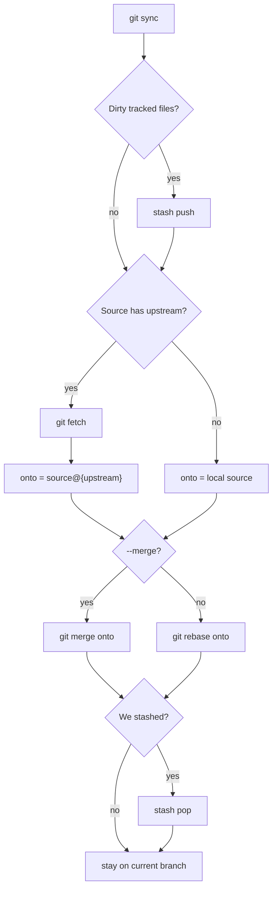

# Task: git-sync-worktrees

* Task ID: git-sync-worktrees
* Complexity: Level 2
* Type: simple enhancement

Replace `git sync`'s checkout-of-source + pull + checkout-back sequence with a checkout-free refresh, so the same command works from a linked worktree and from the primary checkout.

**Algorithm (KISS):** do not check out the source branch. If `SOURCE@{upstream}` exists, `git fetch` and rebase/merge onto that remote-tracking ref. Otherwise rebase/merge onto the local source branch. Stash, confirm, and error restore stay as they are. Never `git -C` another worktree. Never `fetch src:src` into a possibly-checked-out branch.

Tradeoff accepted: unpushed local-only commits on a source branch that is checked out elsewhere are not on `source@{upstream}`. That matches the "primary holds `main`, worktrees hold features" workflow.

## Test Plan (TDD)

### Behaviors to Verify

- Worktree + remote, source held in primary: from a feature worktree, with `main` checked out in the primary and `origin/main` one commit ahead of local `main`, `printf 'y\n' | git sync` → exits 0, caller stays on the feature branch, feature contains the remote commit, primary still has `main` checked out
- Worktree + merge: same setup, `printf 'y\n' | git sync --merge` → exits 0, feature contains the remote commit via merge, primary still on `main`
- Primary checkout of a feature: `main` not checked out, `origin/main` ahead, `printf 'y\n' | git sync` from the primary on the feature branch → exits 0, feature contains the remote commit
- No remote, local source ahead: feature branched from `main`, then a new commit on local `main`, `printf 'y\n' | git sync` from the feature → exits 0, feature contains that local commit, no `checkout` of `main` required
- Cancel: `printf 'n\n' | git sync` → exits 0, HEAD and refs unchanged
- Already on source: `git sync` while on `main` → exits 0, "Nothing to synchronize"
- Stash safety: dirty tracked file plus a pre-existing stash; after a successful sync → worktree dirty file restored, pre-existing stash still on the stack
- Not a repository: invoke outside a git repo → non-zero, error about not a git repository
- Detached HEAD: invoke in detached HEAD → non-zero, error about not on a branch

### Test Infrastructure

- Framework: homemade POSIX suites (`set -eu`, `fail`, `invoke`, isolated `HOME`)
- Test location: `tests/`
- Conventions: `tests/test-<name>.sh`; each file is standalone (copy the small helpers, do not source `test-git-wt.sh`); `make test` lists scripts explicitly
- New test files: `tests/test-git-sync.sh`

## Implementation Plan

### 1. Checkout-free git-sync — executable ✅

- Files: `tests/test-git-sync.sh`, `subcommands/git-sync/git-sync.bash`, `Makefile`

1. Stub tests: add `tests/test-git-sync.sh` with empty `test_*` functions for each behavior above, plus the `test-git-wt.sh`-style helpers (`fail`, `invoke`, `make_repo`, `run_isolated`, `run_one`) and a `main` that links `git-sync.bash` as `git-sync` on an isolated `PATH`.
2. Stub interface: no new public functions or CLI flags. The entrypoint remains `subcommands/git-sync/git-sync.bash`.
3. Write tests and run red: implement the assertions listed under Behaviors. Drive confirm with `printf 'y\n'` / `printf 'n\n'` on stdin (no PTY). Build remotes as local bare repos. Create the worktree case with `git worktree add` while the primary stays on `main`. Run `./tests/test-git-sync.sh` — the worktree and primary-refresh cases must fail on today's checkout+pull path.
4. Write code and run green: in `git-sync.bash`, delete the `git checkout "${SOURCE_BRANCH}"` / `git pull` / `git checkout "${CURRENT_BRANCH}"` block. After stash, if `SOURCE_BRANCH@{upstream}` resolves, `git fetch` and set the rebase/merge operand to that upstream; else use `SOURCE_BRANCH`. On fetch failure, restore stash (already on `CURRENT_BRANCH`) and exit 1. Wire `tests/test-git-sync.sh` into the `Makefile` `test` target (`chmod` line and the run list). Run `./tests/test-git-sync.sh`, then `make test`.

### 2. Sync README workflow — prose/policy ✅

- Files: `subcommands/git-sync/README.md`
- No tests: prose/policy artifact

1. Replace workflow steps 3–5 ("Switch to the source branch / Pull / Switch back") with fetch-upstream / rebase-or-merge-onto-upstream-or-local-source.
2. Note that sync does not check out the source branch, so it works when that branch is already checked out in another worktree.

## Technology Validation

No new technology - validation not required

## Dependencies

- Existing `tests/test-git-wt.sh` helper patterns (copy, do not share)
- Local `git worktree` and bare-repo remotes in tests
- `Makefile` `test` target must list the new suite

## Challenges & Mitigations

- Fetch-into-source (`origin/main:main`) also fails when `main` is checked out elsewhere: do not use that idiom; rebase/merge onto `source@{upstream}` after `git fetch`
- `git remote` can list several remotes: use `SOURCE@{upstream}`, not "first remote" or a hardcoded `origin`
- Confirm prompt: `read -p` reads stdin; tests pipe `y`/`n`. Do not add a PTY helper
- Isolated remotes only: every fetch in tests uses a local bare repo so CI does not touch the network
- First behavioral suite for git-sync: cover only the listed behaviors; do not reconstruct the whole CLI

## Pre-Mortem

- Plan failed because we still updated local `main` (refspec fetch) and hit the same worktree lock: already covered by Challenge 1; algorithm forbids `src:src`
- Plan failed because we built a worktree detector / `git -C` other-worktree pull: cut that; one path is the whole design
- Plan failed because the new suite tested README wording or Makefile line presence: those are change-detectors; do not write them. Makefile wire-up is proven by `make test` running the suite
- Plan failed because no-remote / already-on-source / cancel were skipped and a stash or confirm regression shipped: those cases stay in the suite; they are cheap and lock the parts we are not rewriting

## Status

- [x] Initialization complete
- [x] Test planning complete (TDD)
- [x] Implementation plan complete
- [x] Technology validation complete
- [x] Pre-Mortem complete
- [x] Preflight
- [x] Build
- [ ] QA
