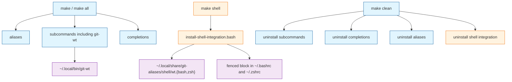
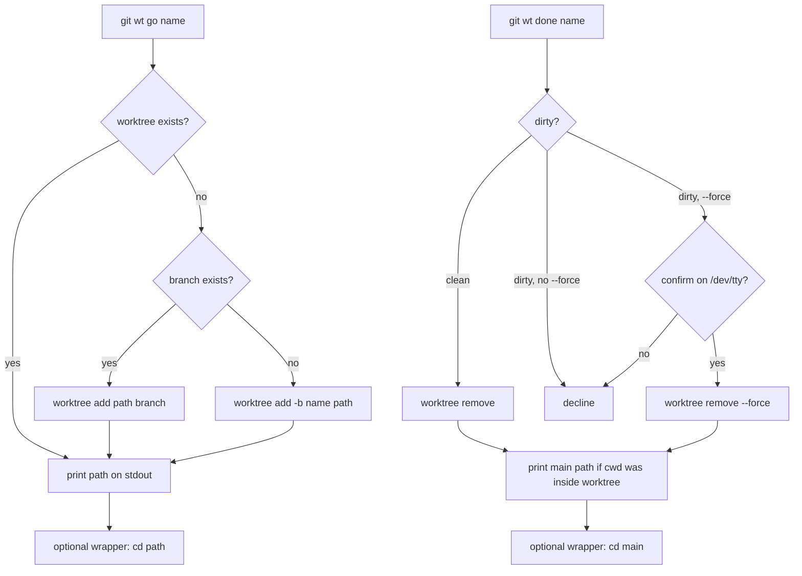

# Task: git-wt

* Task ID: git-wt
* Complexity: Level 3
* Type: feature

Add `git wt` (`go` / `done`) as a Bash Git subcommand with a fixed `~/worktrees/<owner>/<repo>/<repo>-<branch>` layout, plus an opt-in `make shell` install for bash/zsh `wt` wrappers that auto-`cd`. Spec: [issue #5](https://github.com/Texarkanine/git-aliases/issues/5). Behavior is a port of the operator's local `~/.local/bin/wt-{go,done,common.sh}` and zsh `wt()`, consolidated into one `git-wt.bash`. Default `make` must not touch shell RC files.

## Pinned Info

### Default install vs optional shell

Why pinned: the issue's load-bearing split is that `make` / `all` never edits RC files; `make shell` is a separate, documented extra. Mixing those up is the most likely spec miss.

### go / done control flow

Why pinned: this is the public behavior contract (stdout path, dirty/`--force`/confirm, idempotent `go`).

## Component Analysis

### Affected Components
- **git-wt subcommand** (`subcommands/git-wt/git-wt.bash`): new. Git-dispatchable `git wt`. Ports `wt-go` / `wt-done` / `wt-common.sh` into one Bash script (helpers + `go`/`done` + `main`, with a `BASH_SOURCE` main guard). Install is automatic via existing `install-subcommands.sh` glob.
- **Shell wrappers** (`shell/wt.bash`, `shell/wt.zsh`): new, sourceable only. Thin `wt()` that `cd`s on `git wt` stdout. Not a Git subcommand.
- **Shell-integration installer** (`scripts/install-shell-integration.bash`): new. Mirrors `install-completions.sh` fence strip/append. Copies snippets to `~/.local/share/git-aliases/shell/`. `--uninstall` removes fences and snippets. Bash, so the filename is `.bash` (do not add another misnamed `install-*.sh`).
- **Makefile**: add `shell` (not in `all`); `clean` must call shell uninstall; `test` must run the new test files.
- **Tests** (`tests/test-git-wt.sh`, `tests/test-wt-wrappers.sh`, `tests/test-install-shell-integration.sh`): extend the existing POSIX `tests/*.sh` + `make test` pattern. No new test framework.
- **Docs**: `subcommands/git-wt/README.md` (new); root `README.md` (list `git-wt`, document `make shell`).
- **Bash completion**: out of scope for this PR (issue stretch). `install-completions.sh` will not pick anything up until a follow-up adds `git-wt-completion.bash`.

### Cross-Module Dependencies
- Wrappers → `git wt` on `PATH` (subprocess). Wrappers never import `git-wt.bash`.
- `make shell` → installer → RC files + shared snippet dir. Does not install `git-wt`; `make subcommands` remains the subcommand path.
- `make clean` → all three existing uninstallers plus the new shell uninstaller.
- Tests → real `git` for worktree tests; fake `HOME` + prepended `PATH` so operator `~/worktrees`, `~/.local/bin/wt-*`, and zsh `wt()` cannot leak in.
- `git wt` → `git worktree`, `git remote`, `git show-ref`, `git status`, `git check-ref-format`. No other repo subcommands.

### Boundary Changes
- New public CLI: `git wt go <name>`, `git wt done <name> [--force]`, plus usage on missing/unknown command.
- Stdout contract: `go` prints exactly one absolute path; `done` prints the main checkout path only when cwd was inside the removed worktree, otherwise no stdout path. Progress and errors on stderr.
- New Make target `shell` (opt-in public install interface). `all` must not gain `shell`.
- New RC fence: `# >>> git-aliases shell integration >>>` / `# <<< git-aliases shell integration <<<`.
- No change to alias install, identity, or sync.

### Invariants and Constraints
- Default `make` / `all` must not create or modify `~/.bashrc`, `~/.zshrc`, or `~/.local/share/git-aliases/shell/`.
- `go` is idempotent: existing worktree at the computed path → print path, exit 0.
- `done` must refuse the main checkout.
- `done` must refuse a dirty worktree unless `--force`; `--force` on dirty must prompt on `/dev/tty` before `git worktree remove --force`.
- Owner/repo must parse from `origin` (else first remote) for both scp-style `git@host:owner/repo.git` and HTTPS `https://host/owner/repo.git` as the last two path segments after stripping `.git`. The local `wt-common.sh` HTTPS branch is wrong (`https://...` matches `*:*/*` and sets owner to `//github.com/Texarkanine`); do not copy that. No-remote → `owner=local`, `repo=<basename of main checkout>`.
- `git wt` must work when invoked from any linked worktree of the repo (main is the first `git worktree list --porcelain` entry, matching the local helper).
- Tests must set `HOME` to a temp dir; they must not write to the operator's real `~/worktrees` or RC files.
- Subcommand: `.bash` with `#!/usr/bin/env bash` (same as `git-sync`, so Homebrew bash wins over macOS `/bin/bash` 3.2). Tests: `.sh` with `#!/bin/sh` (POSIX). New installer: `scripts/install-shell-integration.bash` (bash, so `.bash`). Makefile recipes stay POSIX. No new runtime dependencies.
- Local `wt()` in `~/.zshrc` and `~/.local/bin/wt-*` are operator-machine leftovers. Automated tests isolate via `zsh -f` / `PATH` / `HOME`. Manual smoke may disable or delete them (operator approved). Not part of the repo diff.

## Open Questions

None - implementation approach is clear. The issue is the spec; the local scripts are the behavior reference; install/fence patterns already exist. HTTPS remote parsing is a known bug in the reference, not a design fork: take the last two path segments after normalizing the URL.

## Test Plan (TDD)

### Behaviors to Verify

- Help / usage: `git wt` with no args, `help`, `-h`, or `--help` → usage on stdout (or stderr; match existing subcommands' help style, but include the issue's usage text), exit 0 for help flags / non-zero for unknown command.
- Unknown command: `git wt foo` → error on stderr, non-zero.
- Not a repo: `git wt go x` outside a git dir → error, non-zero.
- Missing name: `git wt go` / `git wt done` → error, non-zero.
- Invalid branch name: `git wt go '..'` (or other `check-ref-format` failure) → error, non-zero.
- Path with remote SSH: repo remote `git@github.com:Texarkanine/ai-rizz.git`, `git wt go feature-x` → creates ` $HOME/worktrees/Texarkanine/ai-rizz/ai-rizz-feature-x`, prints that absolute path on stdout, progress on stderr.
- Path with remote HTTPS: remote `https://github.com/Texarkanine/ai-rizz.git` → same owner/repo path as SSH (not `//github.com/Texarkanine`).
- Path without remote: main checkout basename `foo`, `git wt go bar` → `$HOME/worktrees/local/foo/foo-bar`.
- `go` new branch: branch does not exist → `git worktree add -b <name> <path>`, branch exists afterwards, stdout is path.
- `go` existing branch: branch exists and is not checked out elsewhere → `git worktree add <path> <branch>`.
- `go` idempotent: second `git wt go <name>` → exit 0, same path, does not fail.
- `go` path exists but is not a worktree: error, non-zero.
- `go` from a linked worktree: running inside an already-added worktree still computes the same layout and can add another.
- `done` missing worktree: error, non-zero.
- `done` refuses main checkout: `git wt done` for the branch checked out in main → error, does not remove main.
- `done` clean: removes worktree, branch remains, stdout empty when cwd is not inside the worktree.
- `done` while cwd inside worktree: stdout is the main checkout absolute path.
- `done` dirty without `--force`: error mentioning dirty/`--force`, worktree remains.
- `done` dirty with `--force` and confirm `y`: worktree removed.
- `done` dirty with `--force` and confirm `n`: aborted, worktree remains.
- `done` unknown option: error, non-zero.
- Wrapper `wt go <name>` (bash and zsh): cwd becomes the path printed by `git wt go`.
- Wrapper `wt done` when `git wt done` prints a path: cwd becomes that path; when stdout empty: cwd unchanged.
- Wrapper unknown command: non-zero, cwd unchanged.
- Installer install: under fake `HOME`, copies `wt.bash`/`wt.zsh`, writes fences to `.bashrc` and `.zshrc` (creating files if absent).
- Installer idempotent: run twice → a single fence pair in each RC, snippets still present.
- Installer uninstall: fences gone, snippet files gone; second uninstall is clean.
- Makefile contract: `all` does not list `shell` as a prerequisite; `clean` invokes shell uninstall.

### Edge Cases

- First remote used when `origin` is absent.
- `done --force` on a clean worktree: no prompt, just remove (local script only prompts when dirty).
- Confirm accepts `yes`/`Y` as well as `y`.
- cwd exactly the worktree vs a subdirectory of it: both count as "inside" for the stdout-main-path rule.
- Operator `wt()` / `wt-go` on the real PATH must not be invoked by tests.

### Test Infrastructure

- Framework: POSIX `tests/*.sh` with a failure counter and `make test` (see `tests/test-trim.sh`). No bats/shunit.
- Test location: `tests/`
- Conventions: `#!/bin/sh`, `set -eu`, print FAIL details to stderr, exit 1 on any failure, success message on stdout.
- New test files:
    - `tests/test-git-wt.sh` — CLI integration against real `git` in temp repos; `HOME` and `PATH` isolated; `--force` confirm driven by a python3 PTY helper inlined in the test file (not a product dependency).
    - `tests/test-wt-wrappers.sh` — source `shell/wt.bash` under Homebrew/`env` bash and `shell/wt.zsh` under `zsh -f`; mock `git` on `PATH` that records args and prints a fake path.
    - `tests/test-install-shell-integration.sh` — run installer with `HOME` in a temp dir; also grep Makefile for the `all`/`clean`/`shell` contract.
- Completions: no new tests (deferred with the stretch item).
- README: no tests (prose/policy).

### Integration Tests

- `test-git-wt.sh` is the integration surface: real `git worktree` + `git-wt` on `PATH` as `git-wt`.
- Wrapper tests integrate wrapper + mock `git` (not real worktrees); they assert `cd` behavior only.
- Installer tests integrate installer + RC files + snippet dir; they do not require a git repo.

## Implementation Plan

### 1. git-wt CLI — executable

- Files: `tests/test-git-wt.sh`, `subcommands/git-wt/git-wt.bash`, `Makefile` (`test` target)
- Creative ref: none

1. [x] Stub tests: create `tests/test-git-wt.sh` with empty cases named for each git-wt behavior above (help, errors, SSH/HTTPS/local paths, go new/existing/idempotent/collision, go from linked worktree, done missing/main/clean/inside/dirty/force-yes/force-no/unknown option). Fixture helpers: temp `HOME`, temp repo with `user.name`/`user.email`, `PATH` prefix containing `git-wt` copied or symlinked from the script under test.
2. [x] Stub interface: `subcommands/git-wt/git-wt.bash` with `#!/usr/bin/env bash`, `set -euo pipefail`, usage function, `cmd_go` / `cmd_done` / helpers (`wt_die`, `wt_main_worktree`, `wt_owner_repo`, `wt_worktree_path`, `wt_worktree_for_branch`, `wt_is_dirty`) empty-but-signed, `main` dispatch, `BASH_SOURCE` guard. Header comments per bash-style.
3. [x] Write tests and run red: implement assertions; run `./tests/test-git-wt.sh` (and keep `./tests/test-trim.sh` passing). All new cases fail.
4. [x] Write code and run green: port local `wt-go`/`wt-done`/`wt-common.sh` into the stub, fixing `wt_owner_repo` so HTTPS and scp-style URLs both yield `owner`/`repo` as the last two path segments. Wire `Makefile` `test` to run `test-git-wt.sh`. Run `./tests/test-git-wt.sh` then `make test`. Note: `git wt --help` is intercepted by git; tests cover `--help` via `git-wt --help`. Idempotent `go` matches on `.git` at the layout path so macOS `/var` vs `/private/var` does not false-collide.

### 2. Shell wrappers — executable

- Files: `tests/test-wt-wrappers.sh`, `shell/wt.bash`, `shell/wt.zsh`
- Creative ref: none

1. [x] Stub tests: `tests/test-wt-wrappers.sh` with empty cases for bash and zsh: `go` cds, `done` with path cds, `done` with empty stdout stays, help, unknown command.
2. [x] Stub interface: `shell/wt.bash` and `shell/wt.zsh` defining `wt()` that errors/returns without `cd`.
3. [x] Write tests and run red: mock `git` executable on `PATH`; source wrappers in `bash` (prefer Homebrew bash if present) and `zsh -f`; assert pwd. Run tests, expect fail.
4. [x] Write code and run green: implement `wt go` → `cd "$(git wt go ...)"`; `wt done` → `cd` only when stdout is non-empty. Usage text from the issue. Wire `make test` to run this file. Run tests then `make test`.

### 3. Shell-integration install — executable

- Files: `tests/test-install-shell-integration.sh`, `scripts/install-shell-integration.bash`, `Makefile`
- Creative ref: none

1. [x] Stub tests: cases for install (files + fences), idempotent reinstall (single fence), uninstall, second uninstall, `all` does not depend on `shell`, `clean` invokes the shell uninstaller.
2. [x] Stub interface: `install-shell-integration.bash` with `#!/usr/bin/env bash`, `set -euo pipefail`, `--uninstall`, empty install/uninstall bodies; Makefile `shell` target and `clean` hook present but no-op or failing.
3. [x] Write tests and run red: run installer against fake `HOME`; parse Makefile prerequisites (`make -n all` / `make -n clean` or a small awk of the Makefile). Expect fail.
4. [x] Write code and run green: copy fence strip/append from `install-completions.sh`; install dir `~/.local/share/git-aliases/shell/`; bashrc sources `wt.bash`, zshrc sources `wt.zsh`; create RC files if missing; `.PHONY: shell`; `shell` not in `all`; `clean` chmod+run `--uninstall`. Wire `Makefile` `test` to run `tests/test-install-shell-integration.sh` (so `make test` runs `test-trim.sh` plus all three new test files). Run `./tests/test-install-shell-integration.sh` then `make test`.

### 4. User-facing docs — prose/policy

- Files: `subcommands/git-wt/README.md`, `README.md`
- No tests: prose/policy artifact

1. [x] Write `subcommands/git-wt/README.md` covering `go`/`done` usage and examples, path convention, stdout/stderr contract, and a prominent Optional Shell Integration section (why it exists, `make` does not install it, how to `make shell`, that `wt` is not a git subcommand). Note removing any prior zsh `wt()` / `wt-go` on `PATH` so the wrapper can be found.
2. [x] Update root `README.md`: list git-wt under Git Subcommands; document `make shell` as optional and not part of default `make`; mention zsh/bash wrappers.

## Technology Validation

No new technology - validation not required. Product runtime remains `git` + `bash`. Tests may use python3 only to drive `/dev/tty` confirmation via a PTY; that is not a runtime dependency. If python3 is missing, those two `--force` cases fail loudly rather than skip.

## Challenges & Mitigations

- **HTTPS parse bug in the local reference**: Mitigation: table-driven path tests for SSH and HTTPS before implementing `wt_owner_repo`; do not paste the `*:*/*` case verbatim.
- **`/dev/tty` under `make test`**: Mitigation: python3 PTY in `test-git-wt.sh` feeds `y`/`n`; production code still reads `/dev/tty` only.
- **HOME / worktree pollution**: Mitigation: every git-wt test exports `HOME` to `mktemp -d` and cleans up; installer tests use a different fake `HOME`.
- **Operator zsh `wt()` shadows the wrapper**: Mitigation: wrapper tests use `zsh -f` and never source `~/.zshrc`. Manual smoke: comment/remove the function in `~/.zshrc` and `~/.local/bin/wt-*` (operator approved). README warns about this.
- **`git worktree add` refuses a branch already checked out**: Mitigation: this is Git's rule; tests create `go` targets that are not checked out in main. Do not paper over it in `git-wt`.
- **macOS `/bin/bash` 3.2 vs Homebrew bash**: Mitigation: shebang `#!/usr/bin/env bash`; wrapper tests invoke Homebrew bash when it exists.
- **Installer accidentally edits the operator's real RC during a botched test**: Mitigation: tests must fail if `HOME` is unset or equals the real home; never run `make shell` against the operator account as part of automated tests.

## Pre-Mortem

- **We shipped the local HTTPS parser and GitHub HTTPS clones land under `~/worktrees//github.com/owner/`**: already covered by Challenge 1 plus explicit HTTPS behaviors in the test plan.
- **Default `make` started appending to `.zshrc`**: already covered by the Makefile contract tests and the pinned install diagram; `shell` stays out of `all`.
- **Tests passed on this machine because they accidentally used the operator's `wt-go`**: already covered by PATH/`zsh -f` isolation; git-wt tests invoke `git wt` / `git-wt` from a temp `bin`, not `wt-go`.
- **`--force` confirm was never actually tested and broke in a real TTY**: already covered by Challenge 2; do not delete those cases if the PTY helper is annoying.
- **We treated bash completion as required and either skipped TDD or built a completion harness**: plan response: defer completion (issue stretch) rather than expand scope.

## Status

- [x] Component analysis complete
- [x] Open questions resolved
- [x] Test planning complete (TDD)
- [x] Implementation plan complete
- [x] Technology validation complete
- [x] Pre-Mortem complete
- [x] Preflight
- [x] Build
  - [x] Unit 1: git-wt CLI
  - [x] Unit 2: shell wrappers
  - [x] Unit 3: shell-integration install
  - [x] Unit 4: user-facing docs
- [ ] QA
