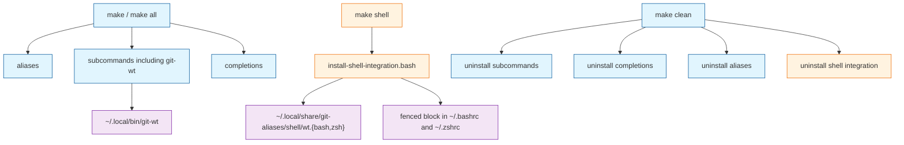
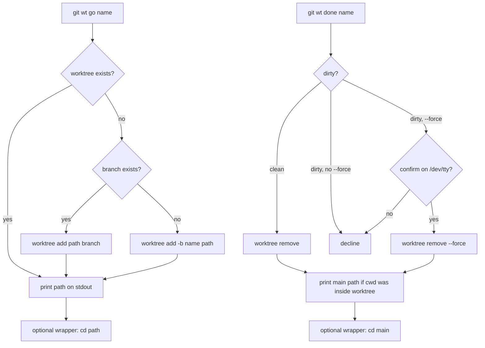

# TASK ARCHIVE: git-wt

## SUMMARY

Added `git wt go` / `git wt done` as a Bash Git subcommand that creates and tears down linked worktrees at `~/worktrees/<owner>/<repo>/<repo>-<branch>`, plus an opt-in `make shell` install for bash and zsh `wt()` wrappers that `cd` from that stdout. Behavior is a port of the operator's local `wt-go` / `wt-done` / `wt-common.sh` and zsh `wt()`, consolidated into one `git-wt.bash`. Default `make` does not edit RC files. Spec: [issue #5](https://github.com/Texarkanine/git-aliases/issues/5). Shipped on [PR #6](https://github.com/Texarkanine/git-aliases/pull/6).

## REQUIREMENTS

From the project brief (issue #5 authoritative):

1. `git wt go <name>` and `git wt done <name> [--force]`: idempotent `go`; dirty / `--force` / `/dev/tty` confirm `done`; refuse to remove the main checkout; stdout/stderr contract.
2. Path convention `~/worktrees/<owner>/<repo>/<repo>-<branch>` with remote parsing (prefer `origin`) and `owner=local` fallback.
3. One subcommand file (`subcommands/git-wt/git-wt.bash`), not separate `wt-go` / `wt-done` binaries.
4. Default `make` / `make subcommands` installs `git-wt` only; no RC changes.
5. `make shell` is a separate target (not part of `all`) that installs bash + zsh wrappers via `install-shell-integration.bash` using the completions fenced-block pattern; `make clean` / `--uninstall` removes fences and snippets.
6. `subcommands/git-wt/README.md` documents usage, path/stdout contract, and optional shell integration. Root README lists the subcommand and `make shell`.
7. Bash completion for `git wt` is stretch (deferred).

Constraints: dialect follows filename (`.bash` = bash, `.sh` = POSIX); Makefile recipes stay POSIX; no runtime deps beyond `git` and `bash`; local `wt-*` is the behavior reference, not a parser to paste; operator login shell is zsh, Homebrew bash for wrapper tests.

## IMPLEMENTATION

Port, not a greenfield design. Logic lives in `subcommands/git-wt/git-wt.bash` (helpers + `cmd_go` / `cmd_done` + `main`, `BASH_SOURCE` guard). `install-subcommands.sh` already globs `*.bash`, so the subcommand installs with default `make`.

Owner/repo: last two path segments after stripping a trailing `.git` and a URL scheme, for both scp-style and HTTPS. The local `wt-common.sh` treated `https://host/owner/repo` as scp-style (`*:*/*`) and would have set owner to `//github.com/Texarkanine`; that bug was named in the plan and not copied.

`make shell` is opt-in. `scripts/install-shell-integration.bash` copies `shell/wt.bash` and `shell/wt.zsh` to `~/.local/share/git-aliases/shell/` and appends a fenced source block to `~/.bashrc` / `~/.zshrc`. Wrappers never import `git-wt.bash`; they run `git wt` and `cd` on stdout. `wt` is a shell function, not a git subcommand.

Default install vs optional shell:

go / done control flow:

Key files:

- `subcommands/git-wt/git-wt.bash` — subcommand
- `shell/wt.bash`, `shell/wt.zsh` — sourced `wt()` wrappers
- `scripts/install-shell-integration.bash` — RC fence + snippet install
- `Makefile` — `shell` not in `all`; `clean` uninstalls; `test` runs the new suites
- `tests/test-git-wt.sh`, `tests/test-wt-wrappers.sh`, `tests/test-install-shell-integration.sh`
- `subcommands/git-wt/README.md`, root `README.md`

Documented deviations from the written plan (environmental, covered by tests):

- `git wt --help` is intercepted by git. Usage is `-h` / `help` through `git wt`, and `--help` on the `git-wt` binary.
- Idempotent `go` keys off `${layout}/.git` so macOS `/var` vs `/private/var` does not look like a path collision.

Post-reflect (PR #6 Cursor review): `git worktree list --porcelain` does not quote paths. awk `$2` truncated a `$HOME` with spaces and `done` failed at `cd`. Both porcelain parsers (and the test helper) use `substr($0, 10)`. Commit `991d3a2`.

After a ShellCheck POSIX pass (`-s sh`: `local`, `[[ ]]`, `(( ))`, `pipefail`, `${url/:/\/}`, `BASH_SOURCE` only — no arrays or process substitution), the operator kept git-wt as bash. That matches `choosing-shell-style` (git subcommands are `*.bash`) and `productContext.md` (subcommands run in bash so Homebrew bash wins over macOS `/bin/bash` 3.2).

No creative phase. Spec + local `wt-*` + the completions fence pattern were enough. The HTTPS parser was a known bug in the reference, not an open design question. Preflight's `git wt list [--porcelain]` advisory was rejected as YAGNI.

## TESTING

TDD in three executable units (stub tests → stub interface → red → green), then prose docs:

- `tests/test-git-wt.sh` — real `git worktree` under throwaway `HOME` and a `PATH` that puts this `git-wt` first. `--force` confirm driven through a python3 PTY (`y` / `n` / `yes`). Includes `test_done_home_with_spaces`.
- `tests/test-wt-wrappers.sh` — sources `wt()` under Homebrew bash and `zsh -f` with a mock `git`.
- `tests/test-install-shell-integration.sh` — fake `HOME`; `make -n all` does not invoke the shell installer; `make -n clean` does, with `--uninstall`.

`make test` (trim, git-wt, wrappers, installer) green at QA and after the porcelain fix.

Level 3 QA (subagent): **PASS**. Advisories only: `wt_worktree_path` two-line stdout is a minor KISS nit; identical bash/zsh wrappers are intentional; shellcheck was not installed on the machine at QA time (installed afterward; not used as a gate).

Preflight: first run **FAIL (fixable)** — Unit 3 said "run `make test`" but did not say "add `test-install-shell-integration.sh` to the Makefile `test` recipe". Plan edited; second preflight **PASS WITH ADVISORY**. Stale memory-bank claim that `scripts/install-*.sh` were POSIX was corrected during plan (filename + matching shebang); those installers were not POSIX-rewritten. `git wt list` stayed out of scope.

## LESSONS LEARNED

Technical:

- `git <subcommand> --help` never reaches the subcommand. Drive `--help` at the `git-<name>` binary on PATH.
- Do not compare `git worktree list --porcelain` paths to `$HOME`-computed paths on macOS: `/var/folders` and `/private/var/folders` are the same directory. Existence of `${layout}/.git` is a more reliable "already a worktree" check.
- URL parsers that treat `*:*/*` as scp-style will eat `https://host/owner/repo` and set owner to `//host/owner`. Last two path segments after stripping scheme and `.git` is the portable rule.
- Porcelain `worktree` lines are `label` + one space + value; the value is not quoted. `substr($0, 10)` keeps spaces; awk `$2` does not. `substr` here is POSIX awk (ASCII prefix), not a GNU/BSD split. git-wt stays bash; that awk is an external POSIX program either way.

Process:

- "Run `make test`" and "add this file to the `test` recipe" are different completeness claims. Preflight should keep asking for the latter when the plan introduces a new test file.
- A local implementation is a behavior reference, not a parser to paste. The one known bug in the reference is the one that would have shipped if `wt_owner_repo` had been copied verbatim.
- A preflight advisory that install scripts "should be POSIX" was a wording bug in the docs, not a prompt to rewrite working Bash installers. `.sh` + bash shebang is misnamed; the fix is rename, not dialect conversion. New bash installers use `.bash`.
- QA chmod'd unrelated `git-identity` / `git-sync` files and `shell/wt.bash`; wrappers are sourced, not executed. Mode bits were reverted at reflect.

## PROCESS IMPROVEMENTS

- Keep the preflight completeness check that new test files are wired into `make test`, not merely executed once.
- Do not treat a stale memory-bank dialect sentence as a rewrite order; check filename + shebang against `choosing-shell-style`.
- When QA (or any subagent) touches file modes outside the task, revert before archive.

## TECHNICAL IMPROVEMENTS

- `wt_worktree_path` returns owner/repo as two stdout lines parsed with `sed -n`. A single `read` would be simpler; not worth a follow-up by itself.
- `git wt list [--porcelain]` and bash completion remain deferred (issue stretch / YAGNI). A later completion can scrape `git worktree list` or add `list` first.
- NUL porcelain (`git worktree list --porcelain -z`) is unnecessary unless we start parsing lock reasons that git quotes.

## NEXT STEPS

- Follow-up: bash completion for `git wt` (`git-wt-completion.bash`).
- Operator machine: disable or remove leftover `~/.local/bin/wt-*` and the zsh `wt()` in `~/.zshrc` so they do not shadow the repo install (approved during the task; not part of the repo diff).
- Separate from this feature: rename misnamed `scripts/install-*.sh` (bash shebang) to `.bash`.
- None otherwise. `make shell` is documented; default `make` stays RC-clean.
