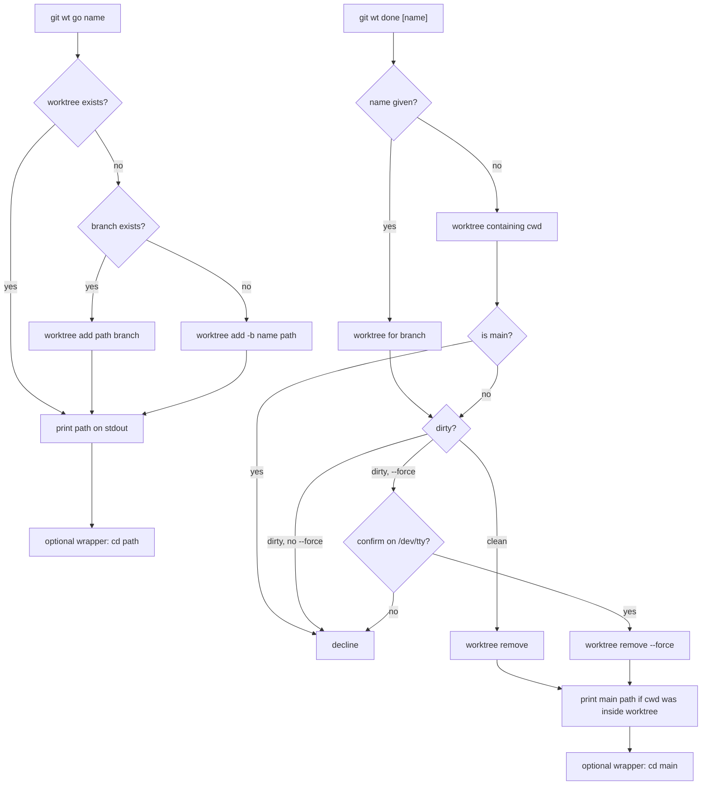

# git-wt

Create and tear down linked worktrees at a fixed path layout.

`git wt` is a Git subcommand. It cannot `cd` your interactive shell — that is what the optional `wt` wrapper is for.

## Usage

```
usage: git wt <command>
  go <name>           create a git worktree; print its path on stdout
  done [name] [--force]
                      remove a worktree so the branch can be checked out
                      in the main tree; omit name to use the current
                      worktree; refuse if dirty unless --force
```

### Examples

```bash
# Create or reuse a worktree; print its path
git wt go feature-x

# Scripts and CI: cd yourself
cd "$(git wt go feature-x)"

# Remove the worktree (refuses if dirty)
git wt done feature-x

# From inside any linked worktree, omit the name
git wt done

# Discard uncommitted changes after a /dev/tty confirmation
git wt done feature-x --force
git wt done --force

# If you ran done while inside the worktree, cd back to main
cd "$(git wt done)"
```

## Path Convention

Worktrees live at:

```
~/worktrees/<owner>/<repo>/<repo>-<branch>
```

- **With a git remote** (prefer `origin`, else the first remote): `owner` and `repo` are the last two path segments of the remote URL after stripping a trailing `.git`. Both scp-style (`git@host:owner/repo.git`) and HTTPS (`https://host/owner/repo.git`) URLs work.
- **Without a remote**: `owner=local`, `repo=<basename of the main checkout>`.

Examples:

- `git@github.com:Texarkanine/ai-rizz.git`, branch `feature-x` → `~/worktrees/Texarkanine/ai-rizz/ai-rizz-feature-x`
- Local repo at `~/projects/foo`, branch `bar` → `~/worktrees/local/foo/foo-bar`

`go` is idempotent: if that worktree already exists, it prints the path and exits 0.

`done` with no name removes the linked worktree that contains cwd, including worktrees `git wt go` did not create. An explicit name still selects that branch's worktree. `done` refuses to remove the main checkout. It refuses a dirty worktree unless `--force`; `--force` on a dirty tree prompts on `/dev/tty` before discarding. The branch is left in place.

Works from any linked worktree of the repo (the main checkout is the first `git worktree list --porcelain` entry).

## Stdout and Stderr

- **`go`**: exactly one absolute path on stdout. Progress on stderr.
- **`done`**: if cwd was inside the removed worktree (the worktree root or a subdirectory), prints the main checkout path on stdout so a wrapper can `cd` there. Otherwise stdout is empty. Progress and errors on stderr.

## Flow



## Optional Shell Integration

`git wt` runs as a subprocess, so it cannot change the directory of your interactive shell. Daily use is nicer with a thin `wt()` function that `cd`s for you:

```bash
wt go <name>   # cd to the new/existing worktree
wt done        # cd to main if git wt done prints a path
wt done <name> # same, for a named worktree
```

`wt` is a shell function, not a Git subcommand. Scripts and CI should keep calling `git wt`.

Default `make` / `make subcommands` installs `git-wt` only. It does **not** edit `~/.bashrc` or `~/.zshrc`.

To install bash and zsh wrappers:

```bash
make shell
```

That copies snippets to `~/.local/share/git-aliases/shell/` and appends a fenced block to `~/.bashrc` and `~/.zshrc`. Re-running is idempotent. `make clean` (or `scripts/install-shell-integration.bash --uninstall`) removes the fences and snippets.

If you already have a `wt()` in `~/.zshrc` or `wt-go` / `wt-done` on `PATH`, remove or comment those out so they do not shadow the installed wrapper.
