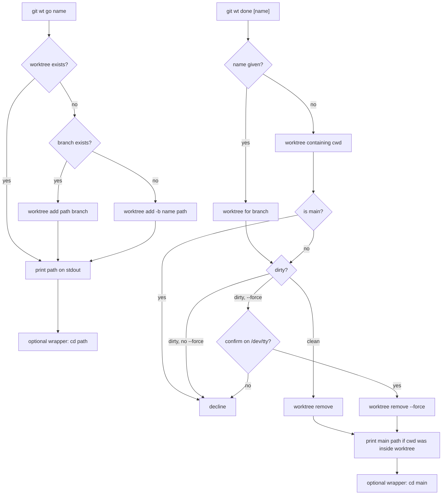
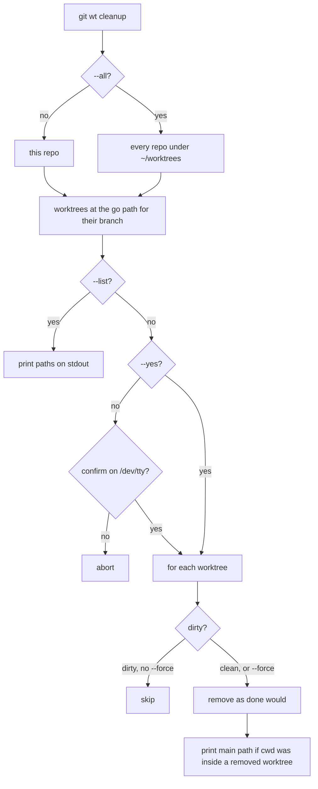

# git-wt

Create and tear down linked worktrees at a fixed path layout.

`git wt` is a Git subcommand. It cannot `cd` your interactive shell — that is what the optional `wt` wrapper is for.

## Usage

```
usage: git wt <command>
  go <name>           create a git worktree; print its path on stdout
  done [name] [--force] [--yes]
                      remove a worktree so the branch can be checked out
                      in the main tree; omit name to use the current
                      worktree; refuse if dirty unless --force; --yes
                      skips the discard confirmation
  cleanup [--all] [--list] [--yes] [--force]
                      remove the worktrees go created in this repo (every
                      repo with --all) after one confirmation; --list
                      prints their paths; dirty ones are skipped unless
                      --force
```

### Examples

```bash
# Create or reuse a worktree; print its path
git wt go feature-x

# Scripts and CI: cd yourself
cd "$(git wt go feature-x)"

# Remove the worktree (refuses if dirty)
git wt done feature-x

# From inside any linked worktree, omit the name
git wt done

# Discard uncommitted changes after a /dev/tty confirmation
git wt done feature-x --force
git wt done --force

# Discard without asking
git wt done feature-x --force --yes

# If you ran done while inside the worktree, cd back to main
cd "$(git wt done)"

# Paths of every worktree go created in this repo (or in every repo)
git wt cleanup --list
git wt cleanup --all --list

# Inspect each one
git wt cleanup --list | while IFS= read -r d; do git -C "$d" status -s; done

# Remove them after one confirmation; dirty ones are skipped
git wt cleanup

# Remove all clean ones without asking
git wt cleanup --yes

# Remove all of them, discarding uncommitted changes, without asking
git wt cleanup --yes --force
git wt cleanup --all --yes --force
```

## Path Convention

Worktrees live at:

```
~/worktrees/<owner>/<repo>/<repo>-<branch>
```

- **With a git remote** (prefer `origin`, else the first remote): `owner` and `repo` are the last two path segments of the remote URL after stripping a trailing `.git`. Both scp-style (`git@host:owner/repo.git`) and HTTPS (`https://host/owner/repo.git`) URLs work.
- **Without a remote**: `owner=local`, `repo=<basename of the main checkout>`.

Examples:

- `git@github.com:Texarkanine/ai-rizz.git`, branch `feature-x` → `~/worktrees/Texarkanine/ai-rizz/ai-rizz-feature-x`
- Local repo at `~/projects/foo`, branch `bar` → `~/worktrees/local/foo/foo-bar`

`go` is idempotent: if that worktree already exists, it prints the path and exits 0.

`done` with no name removes the linked worktree that contains cwd, including worktrees `git wt go` did not create. An explicit name still selects that branch's worktree. `done` refuses to remove the main checkout. It refuses a dirty worktree unless `--force`; `--force` on a dirty tree prompts on `/dev/tty` before discarding, and `--yes` skips that prompt. The worktree directory is deleted from disk, ignored files (e.g. `node_modules`) included. The branch is left in place.

## Cleanup

`cleanup` finds the worktrees `git wt go` created: linked worktrees that exist on disk at the path above for the branch they have checked out. Worktrees made with plain `git worktree add`, or moved elsewhere, are not touched. By default it looks at the current repo. `--all` looks at every repo with a worktree under `~/worktrees`, and works from outside any repo. To find those repos it scans `~/worktrees` without following symlinks, for branch names of up to nine `/`-separated parts.

- `--list` prints their paths, one per line, and removes nothing.
- Otherwise it lists them on stderr and asks once on `/dev/tty`. `--yes` skips the question.
- Each worktree is then removed as `done` would remove it. Branches are left in place.
- Without `--force`, dirty worktrees are listed as skipped and left alone; that is not an error. With `--force`, they are removed and their changes discarded. The single confirmation covers them, so there is no second prompt per worktree.
- If a removal fails (for example, a worktree locked with `git worktree lock`), cleanup reports it, carries on with the rest, and exits non-zero.

Works from any linked worktree of the repo (the main checkout is the first `git worktree list --porcelain` entry).

## Stdout and Stderr

- **`go`**: exactly one absolute path on stdout. Progress on stderr.
- **`done`**: if cwd was inside the removed worktree (the worktree root or a subdirectory), prints the main checkout path on stdout so a wrapper can `cd` there. Otherwise stdout is empty. Progress and errors on stderr.
- **`cleanup --list`**: worktree paths on stdout, one per line; nothing else.
- **`cleanup`**: like `done`, prints the main checkout path on stdout only if cwd was inside a removed worktree, even when another removal failed. The worktree list, prompt, and progress go to stderr and `/dev/tty`.

## Flow





## Optional Shell Integration

`git wt` runs as a subprocess, so it cannot change the directory of your interactive shell. Daily use is nicer with a thin `wt()` function that `cd`s for you:

```bash
wt go <name>   # cd to the new/existing worktree
wt done        # cd to main if git wt done prints a path
wt done <name> # same, for a named worktree
wt cleanup     # cd to main if cleanup removed the current worktree
```

`wt cleanup --list` passes the paths straight through without changing directory.

`wt` is a shell function, not a Git subcommand. Scripts and CI should keep calling `git wt`.

Default `make` / `make subcommands` installs `git-wt` only. It does **not** edit `~/.bashrc` or `~/.zshrc`.

To install bash and zsh wrappers:

```bash
make shell
```

That copies snippets to `~/.local/share/git-aliases/shell/` and appends a fenced block to `~/.bashrc` and `~/.zshrc`. Re-running is idempotent. `make clean` (or `scripts/install-shell-integration.bash --uninstall`) removes the fences and snippets.

If you already have a `wt()` in `~/.zshrc` or `wt-go` / `wt-done` on `PATH`, remove or comment those out so they do not shadow the installed wrapper.
